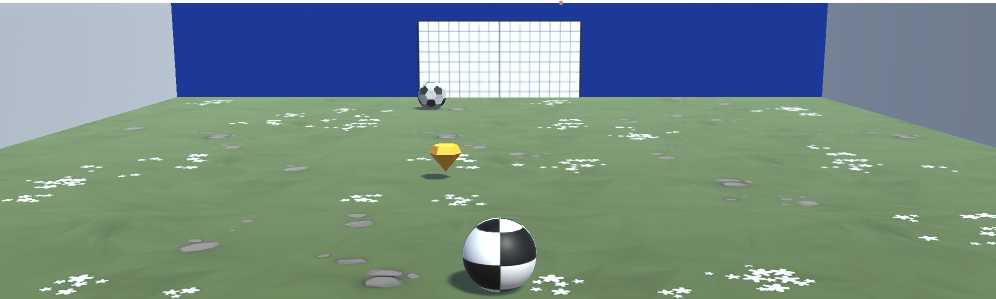

# ⚽ Unity Power Soccer – Sumo Battle Reimagined

This Unity mini project brings the physics and wave systems you learned in the Sumo Battle prototype into a completely new environment: **a soccer field!**  
This time, your goal is not to knock enemies off the edge, but to prevent them from reaching your goal while trying to score on theirs. New powerups, escalating enemy waves, and a completely broken system await. Your true mission? Fix everything!

---

## 📸 Screenshots

### 🎮 Game View:

---

## 🎯 Challenge Overview

### 🎮 Objectives:
- Control the ball by rotating the camera around it
- Move the ball using **forward force**
- Enemy balls move toward your goal
- Deflect enemy balls and try to push them into the opposing goal
- Each round spawns more enemy balls
- Powerups give you a temporary strength boost

---

## ✅ Challenge Outcome

- 🧠 **Enemy balls** move toward your goal
- 🥅 The player can knock enemy balls away with their own ball
- 💥 Powerups grant temporary buffs:
  - When collected, the player gains extra collision force
  - After 5 seconds, the buff and its visual indicator disappear
- 🌊 **Wave system**: The number of enemies increases with each wave
  - `Wave 1`: 1 enemy
  - `Wave 2`: 2 enemies
  - and so on...

---

## 🛠️ Features Used

| Feature                      | Description                                                  |
|------------------------------|--------------------------------------------------------------|
| `Rigidbody.AddForce()`       | Applies forward movement to the player’s ball               |
| `Camera Parenting`           | Camera is set to rotate around the player ball              |
| `OnCollisionEnter()`         | Detects collisions with enemy balls                         |
| `SetActive()`                | Shows/hides the powerup visual indicator                    |
| `Coroutines / WaitForSeconds`| Controls the 5-second duration of the powerup effect        |
| `FindObjectsOfType()`        | Finds all enemy balls in the scene                          |
| `Instantiate()`              | Spawns new enemy balls at the start of each wave            |
| `Debug.Log()`                | Outputs wave transitions and debug messages                 |

---

## 🎮 Controls

| Key             | Action                                              |
|------------------|-----------------------------------------------------|
| ← / →            | Rotates the camera around the player ball           |
| ↑                | Moves the ball forward                              |
| Space            | Applies extra force when a powerup is active        |

---

## 🔁 Game Loop

1. **Game starts**, enemies spawn into the scene.
2. The player moves the ball and tries to deflect enemies.
3. When all enemies are defeated:
   - `waveCount++`
   - New enemies are spawned (+1 more than previous wave)
   - A new powerup spawns
4. Upon collecting the powerup, the player gains 5 seconds of extra collision force.

---

## 🧠 Key Concepts Learned

- Physics-based player movement
- Dynamic enemy tracking and pursuit logic
- Temporary powerup effects using coroutines
- Enemy wave spawning and scaling
- Debugging and fixing broken prototypes

---

## 📁 Project Structure
